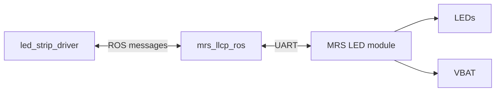

## O trabalho contido nesse repositório foi elaborado para a disciplina de Projeto de Sistemas Embarcados do Departamento de Computação da Universidade Federal de São Carlos

Ele consiste no sistema de controle de LEDs por sinais PWM para o sistema de iluminação de um drone UAV.

Os dois principais códigos do projeto estão contidos nos diretórios firmware e firmware_without_ROS. O primeiro consiste em uma adaptação do código encontrado no repositório: https://github.com/ctu-mrs/mrs_module_led_strip_driver/blob/master/firmware/firmware.ino. 
Esse repositório foi a base para o desenvolvimento do projeto, contendo a implementação do driver ROS e da mensageria entre ele e a placa embarcada. A adaptação do código firmware.ino foi feita para se adequar as necessidades desse projeto, onde apenas uma saida de PWM é necessária.

Já o segundo diretório é uma implementação do firmware sem comunicação com o ROS, variando os valores de PWM com o tempo para alterar a luminosidade.

O texto abaixo é o mesmo encontrado no repositório citado anteriormente, explicando o processo de setup do ROS.


## MRS LED strip module driver

ROS driver for MRS LED module. This allows turning on and off the LED lights with the included 12V DC power outlets, as well as voltage output straight from the battery.
This driver uses the [MRS LLCP protocol](https://github.com/ctu-mrs/mrs_llcp_ros).



# Requirements
* The module microcontroller should have the [firmware](https://github.com/ctu-mrs/mrs_module_led_strip_driver/blob/master/firmware/firmware.ino) installed. Don't forget to get the arduino LLCP library (see [documentation](https://github.com/ctu-mrs/mrs_llcp#using-llcp)).
* The LLCP mesages are defined in the attached [header file](https://github.com/ctu-mrs/mrs_module_led_strip_driver/blob/master/firmware/msgs.h).
* Linked and compiled LED driver [nodelet](https://github.com/ctu-mrs/mrs_module_led_strip_driver) in your [workspace](https://ctu-mrs.github.io/docs/system/preparing_for_a_real-world_experiment.html#set-up-your-own-workspace).
* Linked and compiled MRS LLCP [nodelet](https://github.com/ctu-mrs/mrs_llcp) in modules workspace.
* Correctly set  `.rules` file in `/etc/udev/rules.d`, the LED module portname is `led_strip_driver`
  * For example, on a T650 drone, with the LED module in 2nd module slot, the `99-usb-serial_T650_PCB.rules` file includes this line:
  ```bash
   SUBSYSTEM=="tty", ATTRS{idVendor}=="0403", ATTRS{idProduct}=="6011", ENV{ID_USB_INTERFACE_NUM}=="02", SYMLINK+="led_strip_driver",OWNER="mrs",MODE="0666"
  ```
  * Of course, the `OWNER` and `ENV{ID_USB_INTERFACE_NUM}` parameters have to correspond with your setup
* Wire connection between the onboard computer and distribution board

# How to run
When your workspace is built and sourced launch this file:
```bash
   roslaunch led_strip_driver uav.launch
```
# How to use
Call the following service:
```bash
   rosservice call /YOUR_UAV_NAME/set_outputs "output_a: 10
   output_b: 10
   output_vbat: false"
```
The `output_a` and `output_b` parameters take a value from 0 to 100, that corresponds to the LED brightness. The `output_vbat` is used to toggle the drone battery output on or off.  
